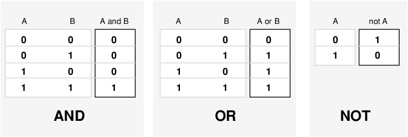
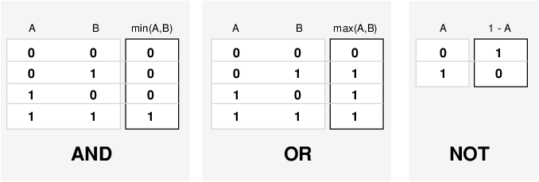

# Chapter 1 The Foundations: Logic and Proofs  

This is the solutions of **computer project and computer exploration** of Chapter 1.  

Usage:  
`g++ main.cpp`  
`./a.out [the number of project you want]`  

---

1. Given the truth values of the propositions p and q, find the truth values of the conjunction, disjunction, exclusive or,conditional statement, and biconditional of these propositions.  

[code](./project_1.hpp)  

Usage && Example:  
`./a.out 1`  

```bash
Enter two truth value(0/1):
> 1 0
conjunction:    0
disjunction:    1
exclusive or:   1
conditional:    0
equivalence:    0
```


2. Given two bit strings of length n, find the bitwise AND, bitwise OR, and bitwise XOR of these strings.  

[code](./project_2.hpp)  
Usage:   
`./a.out 2`

Enter the n(length of string) behind the executable file. (n <= 64)  

Example:  

```bash
Enter two string bit(filled with 0 or 1) with the same size. (not beyond 64!)
Input the the first string of length:
> 00000011111100000011111100000011111111
Now you should enter the second:
> 11111111000000001111111100000000111000
Now checking...
Size of these bit string is 38
       00000011111100000011111100000011111111
       11111111000000001111111100000000111000
------------------------------------------------------------------------------
AND:   00000011000000000011111100000000111000
OR:    11111111111100001111111100000011111111
XOR    11111100111100001100000000000011000111
```


3. Give a compound proposition, determine whether it is satisfiable by checking its truth value for all positive assignments of truth values to its propositional variables

[code](./project_3.hpp)  

Usage:  `./a.out 3`
> negation '!'  
> disjunction: '|'  
> Conjunction: '&'  
> implication: '->'  
> equivalence: '<->'  

Examples(Exercise 1.3.65):  

a:  
```bash
Please enter a compound proposition.
> (p|!q)&(!p|q)&(!p!q)
Satisfiable.
p q (p|!q)&(!p|q)&(!p!q)
0 0   1
```
b:  
```bash
Please enter a compound proposition.
> (p->q)&(p->!q)&(!p->q)&(!p->!q)
This proposition is not satisfiable!
```
c:  
```bash
Please enter a compound proposition.
> (p<->q)&(!p<->q)
This proposition is not satisfiable!
```

In addition, you can also cancel the annotation in `main.hpp` at line 41:
```cpp
if(cin >> p){
        Project_1_3 tmp(p);
        //tmp.print_table();
        //cout << "------------------------------------------------------------------" << endl;
        tmp.print_satisfiable();
    };
```
to
```cpp
if(cin >> p){
        Project_1_3 tmp(p);
        tmp.print_table();
        //cout << "------------------------------------------------------------------" << endl;
        //tmp.print_satisfiable();
    };
```
To see what final results would every combination of truth value in Exercise 1.3.65 yield:  
```bash
Please enter a compound proposition.
> (p<->q)&(!p<->q)
p q (p<->q)&(!p<->q)
1 1   0
1 0   0
0 1   0
0 0   0
```
You can also try to enter a nonsense but complex proposition(not beyond 26) to see its truth table:  
```bash
Please enter a compound proposition.
> (a|b)->(!c<->d)<->(!e&f)
a b c d e f (a|b)->(!c<->d)<->(!e&f)
1 1 1 1 1 1   1
1 1 1 1 1 0   1
1 1 1 1 0 1   0
1 1 1 1 0 0   1
1 1 1 0 1 1   0
1 1 1 0 1 0   0
1 1 1 0 0 1   1
1 1 1 0 0 0   0
1 1 0 1 1 1   0
1 1 0 1 1 0   0
1 1 0 1 0 1   1
1 1 0 1 0 0   0
1 1 0 0 1 1   1
1 1 0 0 1 0   1
1 1 0 0 0 1   0
1 1 0 0 0 0   1
1 0 1 1 1 1   1
1 0 1 1 1 0   1
1 0 1 1 0 1   0
1 0 1 1 0 0   1
1 0 1 0 1 1   0
1 0 1 0 1 0   0
1 0 1 0 0 1   1
1 0 1 0 0 0   0
1 0 0 1 1 1   0
1 0 0 1 1 0   0
1 0 0 1 0 1   1
1 0 0 1 0 0   0
1 0 0 0 1 1   1
1 0 0 0 1 0   1
1 0 0 0 0 1   0
1 0 0 0 0 0   1
0 1 1 1 1 1   1
0 1 1 1 1 0   1
0 1 1 1 0 1   0
0 1 1 1 0 0   1
0 1 1 0 1 1   0
0 1 1 0 1 0   0
0 1 1 0 0 1   1
0 1 1 0 0 0   0
0 1 0 1 1 1   0
0 1 0 1 1 0   0
0 1 0 1 0 1   1
0 1 0 1 0 0   0
0 1 0 0 1 1   1
0 1 0 0 1 0   1
0 1 0 0 0 1   0
0 1 0 0 0 0   1
0 0 1 1 1 1   0
0 0 1 1 1 0   0
0 0 1 1 0 1   1
0 0 1 1 0 0   0
0 0 1 0 1 1   0
0 0 1 0 1 0   0
0 0 1 0 0 1   1
0 0 1 0 0 0   0
0 0 0 1 1 1   0
0 0 0 1 1 0   0
0 0 0 1 0 1   1
0 0 0 1 0 0   0
0 0 0 0 1 1   0
0 0 0 0 1 0   0
0 0 0 0 0 1   1
0 0 0 0 0 0   0
```

4. Given the truth values of the propositions p and q in
fuzzy logic, find the truth value of the disjunction and
the conjunction of p and q (see Exercises 50 and 51 of
Section 1.1).  

What is fuzzy logic?  
[see this](https://www.mathworks.com/help/fuzzy/foundations-of-fuzzy-logic.html)

From there we can know: 
> Logical Operations
>Now that you understand the fuzzy inference, you need to see how fuzzy inference connects with logical operations.

> The most important thing to realize about fuzzy logical reasoning is the fact that it is a superset of standard Boolean logic. In other words, if you keep the fuzzy values at their extremes of 1 (completely true), and 0 (completely false), standard logical operations will hold. As an example, consider the following standard truth tables.  

Considering that, in fuzzy logic, the truth of any statement is a matter of degree, can these truth tables be altered? The input values can be real numbers between 0 and 1. What function preserves the results of the AND truth table (for example) and also extend to all real numbers between 0 and 1?

> One answer is the min operation. That is, resolve the statement A AND B, where A and B are limited to the range (0,1), by using the function min(A,B). Using the same reasoning, you can replace the OR operation with the max function, so that A OR B becomes equivalent to max(A,B). Finally, the operation NOT A becomes equivalent to the operation . The previous truth table is completely unchanged by this substitution.  
  

[code](./project_4.hpp)  

Usage: `./a.out 4`  

```bash
Please enter two proposition[0,1] to yield their fuzzy logic.
> 0.3 0.4
Conjunction of 0.300000 and 0.400000 is 0.300000.
Disjunction of 0.300000 and 0.400000 is 0.400000.
```

5. Given positive integers m and n, interactively play the game of Chomp  

[code](./project_5.hpp)  
Usage: `./a.out 5`  
Example:  
```bash
espeon@Espeon:~/work/discrete/chapter1$ ./a.out 5
Enter the breadth and length of the chomp.
> 10 10
--------------CHOMP--------------
POOOOOOOOO
OOOOOOOOOO
OOOOOOOOOO
OOOOOOOOOO
OOOOOOOOOO
OOOOOOOOOO
OOOOOOOOOO
OOOOOOOOOO
OOOOOOOOOO
OOOOOOOOOO
--------------CHOMP--------------
You should eat the rest of chomp(1<=x<=m and 1<=y<=n)
For Player A:
> 1 2
--------------CHOMP--------------
PXXXXXXXXX
OXXXXXXXXX
OXXXXXXXXX
OXXXXXXXXX
OXXXXXXXXX
OXXXXXXXXX
OXXXXXXXXX
OXXXXXXXXX
OXXXXXXXXX
OXXXXXXXXX
--------------CHOMP--------------
For Player B:
> 2 1
--------------CHOMP--------------
PXXXXXXXXX
XXXXXXXXXX
XXXXXXXXXX
XXXXXXXXXX
XXXXXXXXXX
XXXXXXXXXX
XXXXXXXXXX
XXXXXXXXXX
XXXXXXXXXX
XXXXXXXXXX
--------------CHOMP--------------
For Player A:
> 1 1
Player A Lost
```

