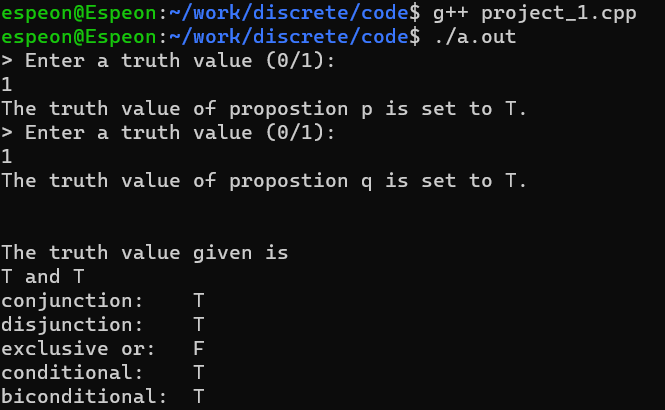
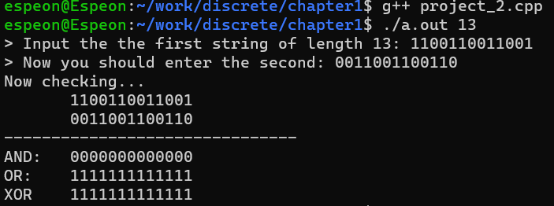
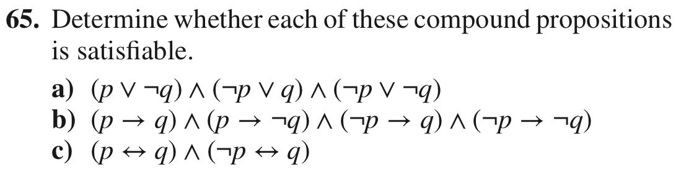
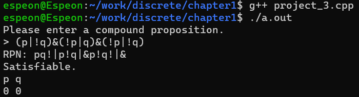
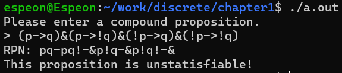
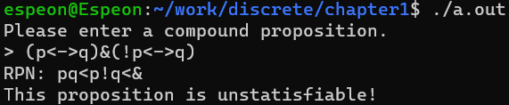
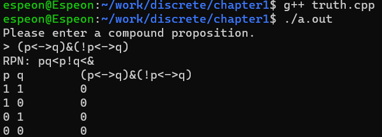

# Chapter 1 The Foundations: Logic and Proofs  

This is the solutions of **computer project and computer exploration** of Chapter 1.  

---

### 1.Given the truth values of the propositions p and q, find the truth values of the conjunction, disjunction, exclusive or,conditional statement, and biconditional of these propositions.  

[code](./project_1.cpp)  

Usage && Example:  
  

### 2.Given two bit strings of length n, find the bitwise AND, bitwise OR, and bitwise XOR of these strings.  
[code](./project_2.cpp)  
Usage:   

Enter the n(length of string) behind the executable file.  

Example:  

### 3.Give a compound proposition, determine whether it is satisfiable by checking its truth value for all positive assignments of truth values to its propositional variables

[code](./project_3.cpp)  

Usage:  
> negation '!'  
> disjunction: '|'  
> Conjunction: '&'  
> implication: '->'  
> equivalence: '<->'  

Examples(Exercise 1.3.65):  

a:  
  
b:  
  
c:  
  

In addition, you can compile the [truth.cpp](./truth.cpp) to print out the truth table of a proposition.  
To see what final results would every combination of truth value in Exercise 1.3.65 yield:  
  

